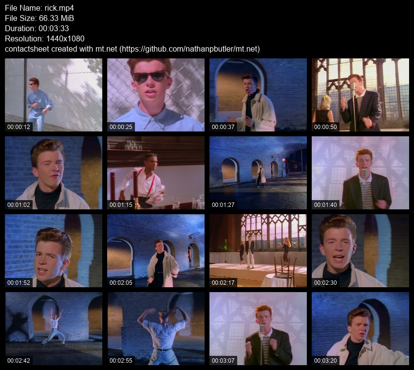

<!-- markdownlint-disable MD033 -->
# mt.net

A .NET port of the Go-based media thumbnailing tool `mt` (media thumbnailer). This tool generates thumbnail contact sheets from video files using FFmpeg, with configurable screenshot count, layout, and styling options.

## Features

- **Video Thumbnail Generation**: Extract frames from video files and create contact sheets
- **Flexible Layout**: Configurable number of screenshots, columns, and dimensions
- **Rich Metadata**: Display file information in headers with timestamps
- **Image Filters**: Apply various filters like greyscale, sepia, invert, and more
- **Content Detection**: Skip blank or blurry frames automatically
- **Multiple Output Formats**: Save contact sheets and individual thumbnails
- **WebVTT Support**: Generate WebVTT files for HTML5 video players
- **Dual Composer System**: FFmpeg.AutoGen (default) or ImageSharp for image composition
- **Comprehensive CLI**: Feature-complete command-line interface with 40+ options

## Example Output

<p align="center">
  
  <br>
  <em>Example contact sheet generated from a video file</em>
</p>

## Installation

### Prerequisites

- .NET 9.0 or later
- FFmpeg (required for video processing)

### Build from Source

```bash
git clone https://github.com/nathanpbutler/mt.net.git
cd mt.net
dotnet build
```

## Quick Start

1. **Install FFmpeg** (required):

   ```bash
   # macOS
   brew install ffmpeg

   # Ubuntu/Debian
   sudo apt-get install ffmpeg

   # Windows: Download from https://ffmpeg.org/download.html
   ```

2. **Build the project**:

   ```bash
   dotnet build
   ```

3. **Generate your first contact sheet**:

   ```bash
   dotnet run -- path/to/your/video.mp4
   ```

## Usage

### Basic Usage

```bash
# Generate a 3x3 grid of thumbnails (default: 4 thumbnails, 2 columns)
dotnet run -- video.mp4

# Custom layout with 9 thumbnails in 3 columns, 300px width
dotnet run -- video.mp4 --numcaps 9 --columns 3 --width 300

# Apply filters and skip blank frames
dotnet run -- video.mp4 --filter greyscale,sepia --skip-blank --header-meta

# Generate individual thumbnail images instead of contact sheet
dotnet run -- video.mp4 --single-images

# Create WebVTT file for HTML5 video players
dotnet run -- video.mp4 --vtt

# Show available filters
dotnet run -- --filters

# Show all available options
dotnet run -- --help
```

### Command Line Options

The tool provides comprehensive command-line options organized into several categories:

#### Basic Options

- `--numcaps, -n`: Number of screenshots to generate (default: 4)
- `--columns, -c`: Number of columns in the grid (default: 2)
- `--width, -w`: Width of individual thumbnails in pixels (default: 400)
- `--height`: Height of individual thumbnails in pixels (default: 0 = auto)
- `--padding, -p`: Padding between images in pixels (default: 10)
- `--output, -o`: Output filename pattern (default: `{{.Path}}{{.Name}}.jpg`)

#### Time Options

- `--interval, -i`: Time interval between captures in seconds (overrides numcaps)
- `--from`: Start time for captures (HH:MM:SS, default: 00:00:00)
- `--to, --end`: End time for captures (HH:MM:SS, default: 00:00:00)
- `--skip-credits`: Skip end credits by cutting off last 2 minutes or 10%

#### Visual Options

- `--filter`: Apply image filters (greyscale, sepia, invert, fancy, cross, strip)
- `--font, -f`: Font to use for timestamps and header (default: DroidSans)
- `--font-size`: Font size in pixels (default: 12)
- `--disable-timestamps, -d`: Disable timestamp overlay on images
- `--timestamp-opacity`: Opacity of timestamp text 0.0-1.0 (default: 1.0)
- `--header`: Include header with file information (default: true)
- `--header-meta`: Include codec, FPS, and bitrate in header
- `--header-image`: Image to display in header
- `--bg-content`: Background color for content area (R,G,B, default: 0,0,0)
- `--bg-header`: Background color for header (R,G,B, default: 0,0,0)
- `--fg-header`: Text color for header (R,G,B, default: 255,255,255)
- `--border`: Border width around thumbnails (default: 0)
- `--watermark`: Watermark image for center thumbnail
- `--watermark-all`: Watermark image for all thumbnails
- `--comment`: Comment to add to header (default: "contactsheet created with mt.net ([https://github.com/nathanpbutler/mt.net](https://github.com/nathanpbutler/mt.net))")

#### Processing Options

- `--skip-blank, -b`: Skip blank frames (up to 3 retries)
- `--skip-blurry`: Skip blurry frames (up to 3 retries)
- `--fast`: Use fast but less accurate seeking
- `--sfw`: Use content filtering for safe-for-work output (experimental)
- `--blur-threshold`: Threshold for blur detection 0-100 (default: 62)
- `--blank-threshold`: Threshold for blank frame detection 0-100 (default: 85)

#### Output Options

- `--single-images, -s`: Save individual images instead of contact sheet
- `--overwrite`: Overwrite existing files
- `--skip-existing`: Skip processing if output already exists
- `--vtt`: Generate WebVTT file for HTML5 video players
- `--webvtt`: Generate WebVTT with disabled headers, padding, and timestamps

#### Upload Options

- `--upload`: Upload generated files via HTTP (**placeholder only - not implemented**)
- `--upload-url`: URL for file upload (default: <http://example.com/upload>) (**placeholder only - not implemented**)

#### Configuration Options

- `--config`: Configuration file path
- `--save-config`: Save current settings to configuration file (**placeholder only - not implemented**)
- `--config-file`: Use specific configuration file (**placeholder only - not implemented**)
- `--show-config`: Show configuration file path and values, then exit (**placeholder only - not implemented**)

#### Global Options

- `--composer`: Choose image composer: `ffmpeg` (default) or `imagesharp`
- `--verbose, -v`: Enable verbose logging
- `--version`: Show version information
- `--filters`: List all available image filters

For a complete list of options, run:

```bash
dotnet run -- --help
```

## Configuration

The application supports configuration through:

1. **JSON Configuration Files**: Store settings in JSON format
2. **Environment Variables**: Use `MT_` prefix for environment variables
3. **Command Line Arguments**: Override any configuration option

### Example Configuration

```json
{
  "numCaps": 16,
  "columns": 4,
  "width": 120,
  "filters": ["greyscale"],
  "skipBlank": true,
  "headerMeta": true
}
```

## Development Status

### ✅ Completed Features

- **Project Structure**: Organized codebase with proper separation of concerns
- **Dependencies**: All required NuGet packages integrated
- **Command-Line Interface**: 100% feature parity with original Go implementation (40+ options)
  - ✅ **Bug Fix (Oct 2025)**: Resolved `-c` alias conflict (now only `--columns` uses `-c`)
- **Configuration System**: JSON config support with environment variables and CLI overrides
- **Video Processing**: ✅ **Migrated to FFmpeg.AutoGen** for direct libavcodec control and frame-level seeking
- **Image Composition**: Dual composer implementations available via `--composer` option
  - ✅ **FFmpeg.AutoGen Composer** (default, hybrid): Uses FFmpeg filter graphs for per-frame processing (resize, text with freetype, borders, filters), ImageSharp for grid layout
  - ✅ **ImageSharp Composer** (legacy): Pure ImageSharp implementation
  - ✅ **Pixel-Perfect Text**: FFmpeg composer uses freetype for exact visual match to original Go mt
  - ✅ **Header Format**: Matches mt's multi-line structure with labels (File Name, File Size, Duration, Resolution)
  - ✅ **Dynamic Header Height**: Automatically adjusts to fit content with or without metadata
  - ✅ **Binary Units**: File sizes display in GiB/MiB (matching mt)
  - ✅ **Timestamp Format**: Always shows HH:MM:SS format (matching mt)
- **Image Filtering**: All filter types implemented (greyscale, sepia, invert, fancy, cross, strip)
- **Content Detection**: Blank and blur frame detection with configurable thresholds
- **Output Management**: File handling, WebVTT generation, and multiple output formats
  - ✅ **WebVTT Generation**: Full feature parity with original Go implementation
    - `--vtt`: Generate WebVTT files with correct coordinate mapping (xywh format)
    - `--webvtt`: Shorthand that auto-disables headers, padding, and timestamps for optimal HTML5 video player compatibility
    - **Dual Timestamp System**: Frame extraction timestamps (avoid video end) vs. VTT display timestamps (even spacing across full duration)
    - **Accurate Coordinates**: Proper calculation including header height and padding offsets
    - **Time Range Coverage**: VTT cues span from 00:00:00 to video duration with evenly-spaced intervals
- **Processing Pipeline**: Fully integrated async workflow with progress reporting
- **Testing**: Verified with real video files, layout working correctly

### 🎯 Performance Benchmarks

Performance comparison against the original Go implementation (44 thumbnails / 4 columns, 1080p video):

| Version | Mode | Time (seconds) | Speed vs Go |
|----------------|----------------|--------------|-------------|
| Go (original mt) | Normal | 10.44s | Baseline |
| Go (original mt) | Fast | 7.52s | 28% faster |
| mt.net v1 (FFMpegCore) | Normal | 58.53s | 5.6x slower ❌ |
| mt.net v1 (FFMpegCore) | Fast | 58.99s | 7.8x slower ❌ |
| **mt.net v2 (FFmpeg.AutoGen)** | **Normal** | **14.53s** | **1.4x slower ✅** |
| **mt.net v2 (FFmpeg.AutoGen)** | **Fast** | **11.07s** | **1.5x slower ✅** |

**Key Takeaway**: The FFmpeg.AutoGen migration achieved **4x performance improvement** over FFMpegCore, bringing mt.net to within ~40-50% of the original Go implementation's speed.

### 🚧 Not Implemented (Placeholders Only)

- **Upload Functionality**: HTTP upload feature (--upload, --upload-url) - placeholders present in CLI but no implementation or timeline
- **Configuration Persistence**: --save-config, --config-file, --show-config - placeholders present in CLI but no implementation or timeline
- **Enhanced Logging**: Serilog is included but not fully integrated for structured logging

### ⚠️ Known Limitations

- **Font Rendering** (ImageSharp composer only): When using `--composer imagesharp`, text rendering uses a different engine than freetype (used by FFmpeg/Go), resulting in slightly different text appearance. The default FFmpeg composer provides pixel-perfect text rendering matching the original Go implementation.
- **--filters Flag**: The `--filters` option to list available filters currently requires a dummy file argument due to System.CommandLine argument validation. Example workaround: Use `--help` to see available options, or provide any path with the flag.

### ⚠️ Prerequisites

**FFmpeg Required**: This tool requires FFmpeg to be installed and available in your system PATH. Download from [ffmpeg.org](https://ffmpeg.org/download.html)

## Dependencies

- **System.CommandLine**: Command-line interface parsing
- **FFmpeg.AutoGen**: Direct FFmpeg bindings for video processing, frame extraction, and image composition (default)
- **SixLabors.ImageSharp**: Image manipulation and legacy composer implementation
- **SixLabors.ImageSharp.Drawing**: Drawing operations for legacy composer
- **SixLabors.Fonts**: Text rendering for legacy composer
- **Microsoft.Extensions.Configuration**: Configuration management
- **Serilog**: Structured logging (planned)

## Contributing

This project is a .NET port of the original Go implementation. The original source code is available in the `reference/original-mt/` directory for reference during development.

### Development Commands

```bash
# Build the project
dotnet build

# Run the application
dotnet run

# Build for release
dotnet build --configuration Release

# Run tests
dotnet test
```

### Project Structure

```text
mt.net/
├── Commands/           # CLI command definitions (RootCommand.cs)
├── Configuration/      # Configuration management (AppConfig, ConfigurationBuilder)
├── Models/            # Data models (ThumbnailOptions, HeaderInfo, ImageFilter)
├── Services/          # Business logic services
│   ├── VideoProcessor.cs          # Video metadata and frame extraction
│   ├── ImageComposer.cs           # Contact sheet creation
│   ├── FilterService.cs           # Image filters
│   ├── ContentDetectionService.cs # Blank/blur detection
│   └── OutputService.cs           # File saving and WebVTT
├── Utilities/         # Helper utilities (ColorParser, TimeSpanParser, FileValidator)
└── reference/         # Original Go implementation
```

## How It Works

1. **Video Analysis**: Extracts video metadata (resolution, duration, codec, fps, bitrate)
2. **Timestamp Calculation**: Determines optimal frame positions based on video duration and options
3. **Frame Extraction**: Uses FFmpeg to capture frames at calculated timestamps
4. **Content Detection**: Optionally skips blank or blurry frames (with retry logic)
5. **Filter Application**: Applies visual effects (greyscale, sepia, fancy rotation, etc.)
6. **Contact Sheet Creation**: Arranges thumbnails in a grid with customizable layout
7. **Header Generation**: Adds metadata header with file information
8. **Timestamp Overlay**: Adds time codes to each thumbnail
9. **Output**: Saves final contact sheet and optionally generates WebVTT file

## License

This project is licensed under the GNU General Public License v3.0. See the [LICENSE](LICENSE) file for details.

## Future Roadmap

### High Priority

1. ✅ **FFmpeg.AutoGen Migration** - COMPLETED
   - Migrated from FFMpegCore to FFmpeg.AutoGen for better performance
   - Achieved 4x performance improvement
   - Implemented true fast seeking behavior with direct libavcodec control
   - ✅ **FFmpeg.AutoGen Composer** - COMPLETED (default as of v2.0, hybrid approach)
     - Pixel-perfect text rendering with freetype matching original Go implementation
     - Uses FFmpeg filter graphs (scale, drawtext, drawbox) for per-frame processing
     - Uses ImageSharp for grid layout composition (simple, maintainable)
     - Available via `--composer ffmpeg` (default) or legacy `--composer imagesharp`
     - Best of both worlds: exact rendering + clean code architecture

### Medium Priority

1. **Upload Service** - Implement HTTP upload functionality for generated contact sheets
2. **Configuration Management** - Implement save/load configuration file features
3. **Enhanced Logging** - Integrate Serilog for structured, configurable logging
4. **Performance Optimization** - Further optimize to close the remaining ~40% performance gap with Go

### Low Priority

1. **Unit Testing** - Add comprehensive test coverage
2. **Documentation** - Expand usage examples and troubleshooting guides
3. **Code Cleanup** - Remove legacy ImageSharp composer after migration period (keeping as fallback temporarily)

### Future Considerations

1. ✅ **FFmpeg.AutoGen for Image Composition** - COMPLETED (v2.0 - Hybrid Approach)
   - Successfully migrated critical operations to FFmpeg's filter graphs
   - **FFmpeg.AutoGen handles**: Frame resizing, text rendering (freetype), borders, image filters
   - **ImageSharp handles**: Grid layout, canvas creation, watermarks (simpler in C#)
   - Achieves pixel-perfect text rendering matching mt (uses freetype)
   - Available as default composer, with ImageSharp as legacy fallback
   - Hybrid approach is intentional and optimal - full FFmpeg migration possible but not necessary
   - Legacy ImageSharp composer will be removed after migration period

## Acknowledgments

This project is based on the original `mt` tool written in Go. Thanks to the original developer for creating such a useful media processing utility.
