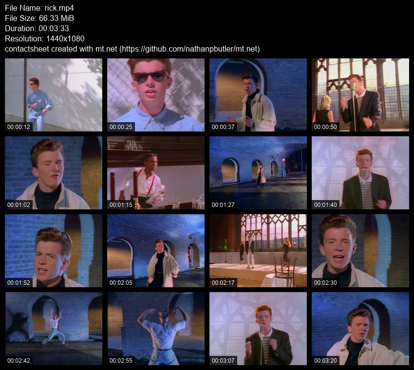

<!-- markdownlint-disable MD033 -->
# mt.net

A .NET port of [mt](https://github.com/mutschler/mt) (media thumbnailer). Generate video thumbnail contact sheets using FFmpeg with configurable layout, filters, and metadata.

<p align="center">
  <a href="https://www.youtube.com/watch?v=dQw4w9WgXcQ"></a>
  <br>
  <em>Example contact sheet</em>
</p>

## Features

- Generate thumbnail contact sheets from video files
- Batch processing: multiple files, directories, and globs
- Configurable grid layout, dimensions, and styling
- Image filters (greyscale, sepia, invert, fancy, cross, strip)
- 360-degree VR video support with a configurable v360 filter
- Skip blank or blurry frames automatically
- WebVTT output for HTML5 video players
- Individual thumbnail export
- JSON output for scripting
- Pure FFmpeg pipeline — no managed imaging dependencies, only two NuGet packages

## Installation

**Requirements:** .NET 10.0+ and FFmpeg 9.x

mt.net renders the header and timestamps with FFmpeg's `drawtext` filter, which is only
available in builds compiled with libfreetype. Install a build that includes it:

```bash
# macOS - use ffmpeg-full, NOT the stock ffmpeg formula.
# Homebrew slimmed down the ffmpeg formula and it is now built without libfreetype,
# which removes the drawtext, subtitles and ass filters.
brew install ffmpeg-full

# Ubuntu/Debian
sudo apt-get install ffmpeg

# Windows
# Download a 9.x shared build from https://www.gyan.dev/ffmpeg/builds and add its bin/ to PATH
```

If mt.net cannot find your FFmpeg libraries, point it at them directly:

```bash
export MT_FFMPEG_PATH=/opt/homebrew/opt/ffmpeg-full/lib
```

If you run against an FFmpeg build without `drawtext`, mt.net still produces a contact
sheet but prints a warning and omits all text.

**Build:**

```bash
git clone https://github.com/nathanpbutler/mt.net.git
cd mt.net
dotnet build
```

## Usage

```bash
# Basic usage (4 thumbnails, 2 columns)
mt video.mp4

# Custom layout
mt video.mp4 --numcaps 9 --columns 3 --width 300

# Apply filters and skip blank frames
mt video.mp4 --filter greyscale,sepia --skip-blank --header-meta

# Individual thumbnails
mt video.mp4 --single-images

# WebVTT for HTML5 players
mt video.mp4 --vtt

# Batch: several files, a whole directory, or a glob
mt a.mp4 b.mkv
mt ./videos --recursive
mt "./videos/*.mkv"

# Scripting: no progress output, one JSON document on stdout
mt ./videos --recursive --quiet --json
```

### Key Options

**Layout:**

- `-n, --numcaps`: Number of screenshots (default: 4)
- `-c, --columns`: Grid columns (default: 2)
- `-w, --width`: Thumbnail width in pixels (default: 400)
- `-h, --height`: Thumbnail height in pixels (default: 0 = auto)
- `-p, --padding`: Padding between images (default: 10)

**Time:**

- `-i, --interval`: Time interval between captures (overrides numcaps)
- `--from`: Start time (HH:MM:SS)
- `--to, --end`: End time (HH:MM:SS)
- `--skip-credits`: Skip last 2 minutes or 10% of video

**Visual:**

- `--filter`: Apply filters (greyscale, sepia, invert, fancy, cross, strip)
- `-f, --font`: Font for timestamps and header (default: DroidSans). A path to a `.ttf` is also accepted
- `--font-size`: Font size in pixels (default: 12)
- `-d, --disable-timestamps`: Disable timestamp overlay
- `--timestamp-opacity`: Timestamp text opacity 0.0-1.0 (default: 1.0)
- `--header`: Include header with file information (default: true)
- `--header-meta`: Include codec, FPS, bitrate in header
- `--header-image`: Image shown on the right of the header; the header grows if the image is taller than the text
- `--bg-content`, `--bg-header`, `--fg-header`: Colors (R,G,B)
- `--border`: Border width around thumbnails (default: 0)
- `--watermark`: Watermark for the center thumbnail
- `--watermark-all`: Watermark for all thumbnails
- `--comment`: Custom comment for header

**360-degree VR:**

- `--v360`: Convert 360-degree footage to a flat projection. Honours `--width`/`--height`
- `--v360-input`: Input projection (default: hequirect)
- `--v360-output`: Output projection (default: flat)
- `--v360-stereo`: Input stereo layout — sbs, tb, 2d (default: sbs)
- `--v360-fov`: Diagonal field of view in degrees (default: 125)
- `--v360-pitch`: Pitch adjustment in degrees (default: -25)

**Processing:**

- `-b, --skip-blank`: Skip blank frames
- `--skip-blurry`: Skip blurry frames
- `--sfw`: Content filtering for safe-for-work output (experimental)
- `--blank-threshold`: Blank detection aggressiveness, 0-100 (default: 50)
- `--blur-threshold`: Blur detection aggressiveness, 0-100 (default: 60)
- `--retries`: Attempts before keeping the best candidate (default: 3)
- `--retry-step`: Seconds to advance between attempts (default: 1.0)
- `--dedupe`: Skip frames that look like ones already chosen
- `--dedupe-threshold`: How alike counts as duplicate, 0-64, lower is stricter (default: 6)
- `--scene-detect`: Prefer a frame just after a scene change near each timestamp
- `--scene-window`: Seconds to search forward for a scene change (default: 5.0)
- `--fast`: Fast but less accurate seeking

For both thresholds, **0 never skips and 100 skips most** — they read the same way round. If no
candidate passes within `--retries` attempts, mt keeps the best one it saw, so `--numcaps N`
always produces N thumbnails.

On long content the default 3-second search window is often too small to escape a dark scene;
raise `--retries` or `--retry-step`. `--scene-detect` costs one extra decode per sample, so it
pairs well with `--fast`.

**Output:**

- `-o, --output`: Output filename pattern (`{{.Path}}` and `{{.Name}}` are substituted per input file)
- `--format`: Output format — auto, jpg, png (default: auto, from the output extension)
- `-q, --quality`: JPEG quality 1-100 (default: 90); ignored for PNG
- `-s, --single-images`: Save individual images
- `--overwrite`: Overwrite existing files (default: auto-increment with -01, -02, etc.)
- `--skip-existing`: Skip processing if output already exists
- `--vtt`: Generate WebVTT file
- `--webvtt`: WebVTT mode (disables headers, padding, timestamps)
- `--no-mtime`: Do not apply input file's modified date to output files (default: applies mtime)

**Input:**

- `-r, --recursive`: Recurse into subdirectories when an input is a directory or glob

**Global:**

- `-v, --verbose`: Verbose logging
- `--quiet`: Suppress everything except errors
- `--json`: Emit a JSON summary to stdout instead of progress output
- `--filters`: List all available image filters
- `--help`: Show all options
- `--version`: Show version information

## JSON output

`--json` writes a single document to stdout describing every input processed — its metadata, the
contact sheet geometry, and the files written. Progress output is suppressed, so stdout stays
parseable.

```jsonc
{
  "results": [
    {
      "input": "sample.mp4",
      "success": true,
      "outputs": ["sample.jpg"],
      "vtt": "sample.vtt",
      "frames": 4,
      "metadata": { "durationSeconds": 60, "width": 1280, "videoCodec": "h264", ... },
      "layout": { "headerHeight": 152, "thumbnailWidth": 400, "sheetWidth": 830, ... }
    }
  ]
}
```

A file that fails to process gets `"success": false` and an `"error"` message rather than
aborting the run; the exit code is non-zero if any input failed.

## Changes in v3

v3 is a correctness release: every option now does what `--help` says it does. Output differs
from v2 in several places as a result.

**Options that did nothing before and now work:**

- `--single-images` applied *no* rendering at all — it wrote raw full-resolution frames, silently
  ignoring `--filter`, `--width`, `--height`, `--border`, `--font-size`, `--timestamp-opacity`
  and `--disable-timestamps`. It now runs the same pipeline as the contact sheet.
- `--watermark-all` was a complete no-op (it modified frames after composition, then discarded them).
- `--watermark` was blended over the centre of the whole sheet; it now targets the centre thumbnail.
- `--header-image` was parsed and then never read by anything.
- `--verbose` was never assigned, so every verbosity check was dead code.
- `--quality` had no effect: the JPEG encoder was given the quantiser on the codec context but not
  on the frame, so all output was written at the encoder default.

**Bugs fixed:**

- WebVTT sprite offsets were computed with a different header-height formula than the renderer
  used, so every cue pointed ~25px off. Geometry now comes from the composed sheet itself.
- WebVTT timestamps past 24 hours wrapped to 00, producing backwards, invalid cues.
- `--v360` hardcoded 400x300 thumbnails while the grid was sized from `--width`, leaving gaps.
- `--filters` needed a dummy file argument to run.
- A frame rejected by content detection could be returned after disposal on the final retry.

**Removed:** `--config`, `--config-file`, `--save-config`, `--show-config`, `--upload` and
`--upload-url`. All six were placeholders that never did anything; the configuration layer behind
them was built and then discarded on every run. Seven NuGet dependencies went with them.

**Added:** multiple/directory/glob inputs with `--recursive`, `--quality`, `--format`, `--quiet`,
`--json`, and `--v360-input`/`--v360-output`/`--v360-stereo`/`--v360-fov`/`--v360-pitch`.

**Also note:** because `--quality` previously had no effect, v2 wrote every JPEG at maximum
quality. v3 honours the documented default of 90, so files are smaller. Pass `--quality 100` for
the old behaviour.

## Implementation Status

**Complete:**

- FFmpeg.AutoGen video decoder with direct libavcodec control, reused across a file's frames
- Pure FFmpeg pipeline (filter graphs for rendering, raw RGBA rasters for layout)
- Pixel-perfect text rendering with freetype (matches original)
- WebVTT generation with coordinate mapping taken from the composed sheet
- Image filters, content detection, metadata headers
- Batch input resolution and JSON reporting

**Not Implemented:**

- No test project yet — see the note under Development

## Architecture

```plaintext
mt.net/
├── Program.cs                      # Entry point
├── Commands/
│   └── RootCommand.cs              # CLI definitions and the per-file pipeline
├── Models/
│   ├── ThumbnailOptions.cs         # Generation options and validation
│   ├── SheetLayout.cs              # Composed sheet geometry (single source of truth)
│   ├── JsonReport.cs               # --json document shape
│   ├── HeaderInfo.cs               # Metadata
│   └── RgbaImage.cs                # RGBA raster (pixel container)
├── Services/
│   ├── VideoProcessor.cs           # Metadata extraction, timestamps
│   ├── FFmpegAutoGenVideoDecoder.cs # Frame extraction
│   ├── FFmpegFilterGraphComposer.cs # Frame rendering and contact sheet composition
│   ├── FFmpegFilterService.cs      # FFmpeg filters
│   ├── ContentDetectionService.cs  # Blank/blur detection
│   ├── ImageEncoder.cs             # PNG/JPEG encoding via FFmpeg
│   ├── ImageLoader.cs              # Still image decoding via FFmpeg
│   ├── WatermarkService.cs         # Watermark blending
│   └── OutputService.cs            # File/WebVTT output
└── Utilities/
    ├── AVFrameBridge.cs            # RgbaImage <-> AVFrame
    ├── ColorParser.cs              # RGB parsing
    ├── ConsoleOutput.cs            # Verbosity routing for --quiet/--verbose/--json
    ├── InputResolver.cs            # File/directory/glob expansion
    ├── FileValidator.cs            # Supported extensions
    ├── RgbaColor.cs                # RGBA colour struct
    ├── TimeSpanParser.cs           # Time parsing
    └── FFmpegHelper.cs             # FFmpeg helpers
```

## Development

```bash
# Build
dotnet build

# Run
dotnet run -- video.mp4

# Release build
dotnet build --configuration Release
```

There is no test project yet. One is planned before the v3 release, covering the FFmpeg-free
logic: timestamp calculation, output path building, sheet geometry, WebVTT coordinates, and the
time/colour/input parsers.

The original Go source is in `reference/original-mt/` for reference (a git submodule — run
`git submodule update --init` to populate it).

## License

GNU General Public License v3.0. See [LICENSE](LICENSE).

## Acknowledgments

Based on the original [mt](https://github.com/mutschler/mt) tool by mutschler.
